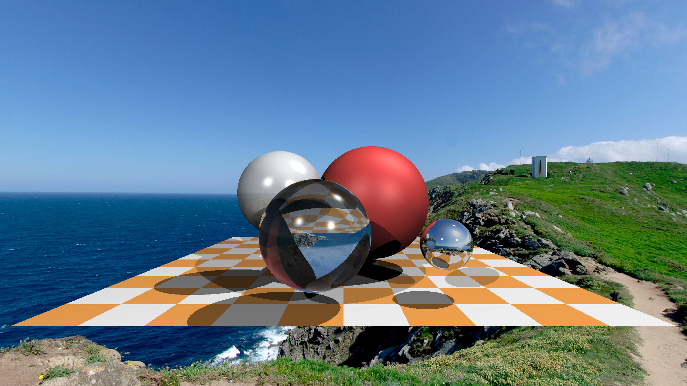

# TinyRayTracer-CSharp

> Original repository:
> [ssloy/tinyraytracer : A brief computer graphics / rendering course](https://github.com/ssloy/tinyraytracer)

## Screenshots:

Photo by 🇻🇪 Jose G. Ortega Castro 🇲🇽 on Unsplash 

